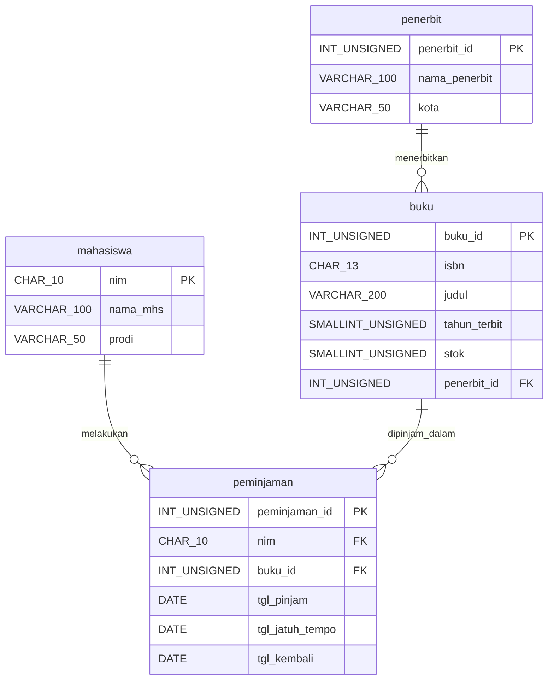

# Tugas Modul 6: Perancangan ERD E-Library Kampus

**Nama:** Gracia Aurelya
**NIM:** D121241095
**Mata Kuliah:** Pemrograman Website

## 1. Skenario

Basis data relasional dirancang untuk sistem peminjaman buku perpustakaan kampus. Sistem mencatat data mahasiswa, buku, penerbit, serta riwayat peminjaman dan pengembalian.

Asumsi perancangan:

1. Satu mahasiswa dapat meminjam banyak buku, dan satu buku dapat dipinjam banyak mahasiswa pada waktu berbeda (relasi many to many, diurai oleh tabel `peminjaman`).
2. Satu penerbit menerbitkan banyak buku, tetapi satu buku hanya memiliki satu penerbit.
3. Satu baris `peminjaman` mewakili satu buku yang dipinjam oleh satu mahasiswa pada satu tanggal pinjam.
4. Kolom `tgl_kembali` bernilai NULL selama buku belum dikembalikan.
5. Penamaan mengikuti standar modul: huruf kecil dengan garis bawah, nama tabel berupa kata benda tunggal, dan nama Foreign Key sama dengan Primary Key yang dirujuk.

## 2. Desain ERD

### 2.1 Entitas dan Atribut

| Entitas | Atribut | Primary Key | Foreign Key |
|---|---|---|---|
| `penerbit` | penerbit_id, nama_penerbit, kota | penerbit_id | tidak ada |
| `buku` | buku_id, isbn, judul, tahun_terbit, stok, penerbit_id | buku_id | penerbit_id → penerbit.penerbit_id |
| `mahasiswa` | nim, nama_mhs, prodi | nim | tidak ada |
| `peminjaman` | peminjaman_id, nim, buku_id, tgl_pinjam, tgl_jatuh_tempo, tgl_kembali | peminjaman_id | nim → mahasiswa.nim, buku_id → buku.buku_id |

### 2.2 Relasi Antar Entitas

| Relasi | Kardinalitas | Keterangan |
|---|---|---|
| penerbit ke buku | 1 : N | Satu penerbit menerbitkan banyak buku |
| mahasiswa ke peminjaman | 1 : N | Satu mahasiswa dapat melakukan banyak peminjaman |
| buku ke peminjaman | 1 : N | Satu buku dapat muncul pada banyak riwayat peminjaman |
| mahasiswa ke buku | M : N | Diurai oleh tabel `peminjaman` sebagai tabel penghubung |

# 3. Simulasi Normalisasi

### 3.1 Bentuk Tidak Normal (UNF)

Seluruh data dicatat dalam satu tabel. Kolom terakhir berisi kelompok data berulang (lebih dari satu buku dalam satu sel).

| NIM | Nama_Mhs | Prodi | Buku Dipinjam {ISBN, Judul, Tahun, Stok, Penerbit, Kota_Penerbit, Tgl_Pinjam, Jatuh_Tempo, Tgl_Kembali} |
|---|---|---|---|
| D121241001 | Rian | Teknik Informatika | {9786020001001, Basis Data, 2020, 5, Informatika, Bandung, 01 Sep 2026, 08 Sep 2026, 07 Sep 2026}, {9786020002002, Algoritma, 2019, 3, Gramedia, Jakarta, 01 Sep 2026, 08 Sep 2026, 07 Sep 2026} |
| D121241002 | Akbar | Teknik Elektro | {9786020001001, Basis Data, 2020, 5, Informatika, Bandung, 03 Sep 2026, 10 Sep 2026, NULL} |

Masalah: kolom terakhir memuat banyak nilai dalam satu sel, sehingga tabel belum memenuhi syarat paling dasar.

### 3.2 Konversi ke 1NF

Syarat: setiap sel hanya berisi satu nilai atomik dan tidak ada kelompok data berulang. Kelompok buku dipecah menjadi baris tersendiri. Kunci utama menjadi kunci komposit **(NIM, ISBN, Tgl_Pinjam)**.

| NIM (PK) | ISBN (PK) | Tgl_Pinjam (PK) | Nama_Mhs | Prodi | Judul | Tahun | Stok | Penerbit | Kota_Penerbit | Jatuh_Tempo | Tgl_Kembali |
|---|---|---|---|---|---|---|---|---|---|---|---|
| D121241001 | 9786020001001 | 01 Sep 2026 | Rian | Teknik Informatika | Basis Data | 2020 | 5 | Informatika | Bandung | 08 Sep 2026 | 07 Sep 2026 |
| D121241001 | 9786020002002 | 01 Sep 2026 | Rian | Teknik Informatika | Algoritma | 2019 | 3 | Gramedia | Jakarta | 08 Sep 2026 | 07 Sep 2026 |
| D121241002 | 9786020001001 | 03 Sep 2026 | Akbar | Teknik Elektro | Basis Data | 2020 | 5 | Informatika | Bandung | 10 Sep 2026 | NULL |

Masalah yang tersisa: terjadi redundansi. Nama dan prodi Rian ditulis ulang pada setiap buku yang ia pinjam, dan data buku "Basis Data" ditulis ulang pada setiap peminjamnya.

### 3.3 Konversi ke 2NF

Syarat: memenuhi 1NF dan seluruh atribut bukan kunci bergantung penuh pada seluruh kunci utama. Analisis ketergantungan fungsional:

| Ketergantungan | Jenis |
|---|---|
| NIM → Nama_Mhs, Prodi | Parsial (hanya bergantung pada sebagian kunci) |
| ISBN → Judul, Tahun, Stok, Penerbit, Kota_Penerbit | Parsial (hanya bergantung pada sebagian kunci) |
| (NIM, ISBN, Tgl_Pinjam) → Jatuh_Tempo, Tgl_Kembali | Penuh (bergantung pada seluruh kunci) |

Ketergantungan parsial dipisahkan ke tabel baru:

**Tabel `mahasiswa`** (PK: nim)

| nim | nama_mhs | prodi |
|---|---|---|
| D121241001 | Rian | Teknik Informatika |
| D121241002 | Akbar | Teknik Elektro |

**Tabel `buku`** (PK: isbn)

| isbn | judul | tahun_terbit | stok | nama_penerbit | kota_penerbit |
|---|---|---|---|---|---|
| 9786020001001 | Basis Data | 2020 | 5 | Informatika | Bandung |
| 9786020002002 | Algoritma | 2019 | 3 | Gramedia | Jakarta |

**Tabel `peminjaman`** (PK: nim + isbn + tgl_pinjam)

| nim | isbn | tgl_pinjam | tgl_jatuh_tempo | tgl_kembali |
|---|---|---|---|---|
| D121241001 | 9786020001001 | 01 Sep 2026 | 08 Sep 2026 | 07 Sep 2026 |
| D121241001 | 9786020002002 | 01 Sep 2026 | 08 Sep 2026 | 07 Sep 2026 |
| D121241002 | 9786020001001 | 03 Sep 2026 | 10 Sep 2026 | NULL |

Masalah yang tersisa: pada tabel `buku`, `kota_penerbit` bergantung pada `nama_penerbit`, padahal `nama_penerbit` bukan kunci utama. Inilah ketergantungan transitif: `isbn → nama_penerbit → kota_penerbit`. Jika Penerbit Informatika pindah kota, data harus diubah di banyak baris buku (anomali pembaruan).

### 3.4 Konversi ke 3NF

Syarat: memenuhi 2NF dan tidak ada atribut bukan kunci yang bergantung pada atribut bukan kunci lain. Data penerbit dipisahkan ke tabel `penerbit` dengan kunci buatan `penerbit_id`, lalu `buku` merujuknya melalui Foreign Key. Agar join lebih efisien dan kunci lebih ringkas, `buku` diberi kunci buatan `buku_id` (kolom `isbn` tetap unik sebagai candidate key), dan `peminjaman` diberi `peminjaman_id` sebagai pengganti kunci komposit tiga kolom.

| Tabel | Kunci Utama | Kunci Tamu | Kolom Data |
|---|---|---|---|
| `penerbit` | penerbit_id | tidak ada | nama_penerbit, kota |
| `buku` | buku_id | penerbit_id | isbn, judul, tahun_terbit, stok |
| `mahasiswa` | nim | tidak ada | nama_mhs, prodi |
| `peminjaman` | peminjaman_id | nim, buku_id | tgl_pinjam, tgl_jatuh_tempo, tgl_kembali |

Hasil: tidak ada kelompok berulang (1NF), tidak ada ketergantungan parsial (2NF), dan tidak ada ketergantungan transitif (3NF). Anomali sisip, hapus, dan pembaruan teratasi. Contohnya, penerbit baru dapat dicatat tanpa harus ada bukunya, dan perubahan kota penerbit cukup dilakukan pada satu baris.

## 4. Rancangan Tabel Akhir

### 4.1 Tabel `penerbit`

| Kolom | Tipe Data | Kunci | Constraint | Keterangan |
|---|---|---|---|---|
| penerbit_id | INT UNSIGNED | PK | AUTO_INCREMENT, NOT NULL | Identitas unik penerbit |
| nama_penerbit | VARCHAR(100) | | NOT NULL, UNIQUE | Nama penerbit |
| kota | VARCHAR(50) | | NULL | Kota kedudukan penerbit |

### 4.2 Tabel `buku`

| Kolom | Tipe Data | Kunci | Constraint | Keterangan |
|---|---|---|---|---|
| buku_id | INT UNSIGNED | PK | AUTO_INCREMENT, NOT NULL | Identitas unik buku |
| isbn | CHAR(13) | | NOT NULL, UNIQUE | Nomor ISBN buku |
| judul | VARCHAR(200) | | NOT NULL | Judul buku |
| tahun_terbit | SMALLINT UNSIGNED | | NOT NULL | Tahun terbit |
| stok | SMALLINT UNSIGNED | | NOT NULL, DEFAULT 0 | Jumlah eksemplar tersedia |
| penerbit_id | INT UNSIGNED | FK | NOT NULL | Merujuk penerbit.penerbit_id |

### 4.3 Tabel `mahasiswa`

| Kolom | Tipe Data | Kunci | Constraint | Keterangan |
|---|---|---|---|---|
| nim | CHAR(10) | PK | NOT NULL | Nomor induk mahasiswa |
| nama_mhs | VARCHAR(100) | | NOT NULL | Nama lengkap mahasiswa |
| prodi | VARCHAR(50) | | NOT NULL | Program studi |

### 4.4 Tabel `peminjaman`

| Kolom | Tipe Data | Kunci | Constraint | Keterangan |
|---|---|---|---|---|
| peminjaman_id | INT UNSIGNED | PK | AUTO_INCREMENT, NOT NULL | Identitas unik transaksi |
| nim | CHAR(10) | FK | NOT NULL | Merujuk mahasiswa.nim |
| buku_id | INT UNSIGNED | FK | NOT NULL | Merujuk buku.buku_id |
| tgl_pinjam | DATE | | NOT NULL | Tanggal buku dipinjam |
| tgl_jatuh_tempo | DATE | | NOT NULL | Batas tanggal pengembalian |
| tgl_kembali | DATE | | NULL | Tanggal dikembalikan, NULL jika belum kembali |

### 4.5 Aturan Integritas Referensial

| Foreign Key | Merujuk | ON DELETE | ON UPDATE | Alasan |
|---|---|---|---|---|
| buku.penerbit_id | penerbit.penerbit_id | RESTRICT | CASCADE | Penerbit tidak boleh dihapus selama masih punya buku |
| peminjaman.nim | mahasiswa.nim | RESTRICT | CASCADE | Riwayat peminjaman wajib dipertahankan |
| peminjaman.buku_id | buku.buku_id | RESTRICT | CASCADE | Riwayat peminjaman wajib dipertahankan |

`ON DELETE CASCADE` sengaja tidak dipakai pada `peminjaman` karena menghapus mahasiswa atau buku akan ikut menghapus data historis transaksi secara berantai dan tidak dapat dipulihkan.

## 5. Visualisasi Relasi Kunci

### 5.1 Diagram Mermaid



### 5.2 Diagram Alur Teks

```text
penerbit
  penerbit_id (PK) ..... nama_penerbit, kota
        |
        | 1 : N
        v
buku
  buku_id (PK) ......... isbn, judul, tahun_terbit, stok
  penerbit_id (FK) ---- penerbit.penerbit_id
        |
        | 1 : N
        v
peminjaman
  peminjaman_id (PK) ... tgl_pinjam, tgl_jatuh_tempo, tgl_kembali
  nim (FK) ------------ mahasiswa.nim
  buku_id (FK) -------- buku.buku_id
        ^
        | 1 : N
        |
mahasiswa
  nim (PK) ............. nama_mhs, prodi
```

Pembacaan diagram:

1. Tabel `peminjaman` berperan sebagai tabel penghubung relasi many to many antara `mahasiswa` dan `buku`.
2. Satu penerbit dapat memiliki banyak buku, sedangkan satu buku hanya memiliki satu penerbit.
3. Setiap Foreign Key wajib merujuk nilai yang benar-benar ada di tabel induk.


